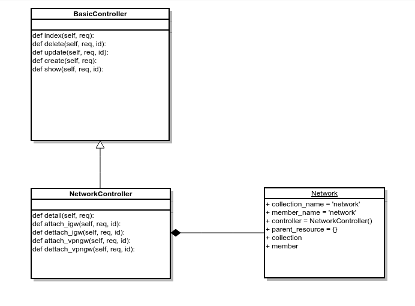

<h1> Network Resource </h1>

<h3> Biểu đồ lớp </h3>

Các lớp NetworkController kế thừa từ một lớp BasicController (hiện tại thì viết tạm luôn vào controller).

Các lớp Network sẽ chưa các thuộc tính:
+ collection_name = 'network'
+ member_name = 'network'
+ controller : khởi tạo đối tượng Controller ở trên
+ parent_resource : {} vì nó là resource cha rồi.
+ collection = {'detail':'GET'} là danh sách cách action và method tương ứng được bổ sung từ lớp cơ bản cho resource này.
+ member : tương tự như trên, là danh sách các action và method của member resource.

<h3> Codeflow </h3>

Mỗi một action của resource sẽ được đặt dưới decorator:
+ validate_driver : chức năng kiểm tra driver ở trạng thái active hay không (active nghĩa là gì?)
+ validate_resource : với chức năng kiểm đủ quyền thực thi hay không (cần chỉnh sủa thêm nếu có phần policy cho từng action cụ thể)

Như vậy, khi thực thi, mỗi action sẽ hoạt động như sau:
<pre><code>
check_driver(request):
  driver = get_driver()
  if True:
    check_resource(driver, request):
      if True:
        driver.action()
      else:
        raise
  else:
    raise
</code></pre>

1. Khi một action được gọi, đầu tiên, hàm check_driver() sẽ được gọi, lấy driver từ Driver Manager Extension và kiểm tra driver.active không. Nếu không thì thông báo lỗi về Cloud mà người dùng lựa chọn không active. Nếu có thì sang bước 2.

2. Tiếp đến, hàm check_resource() được gọi. Kiểm tra action đó có được quyền thực thi hay không? Nếu không, báo lỗi quyền thực thi. Nếu có, tiếp tục sang bước 3

3. Bây giờ là lúc mà hàm chính mới thực hiện. Đây là lúc mình sử dụng driver để thực hiện các thao tác trên cloud cụ thể với yêu cầu của người dùng đầu cuối.
